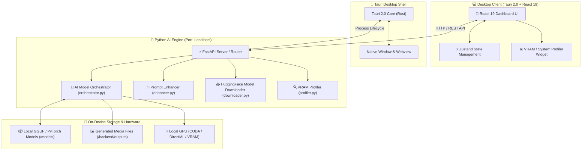
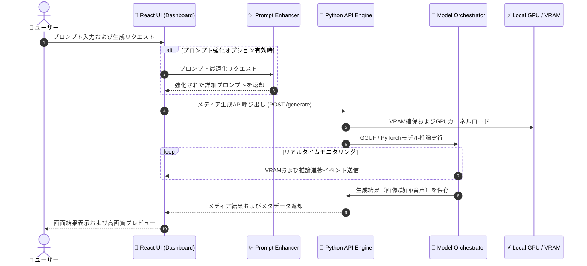
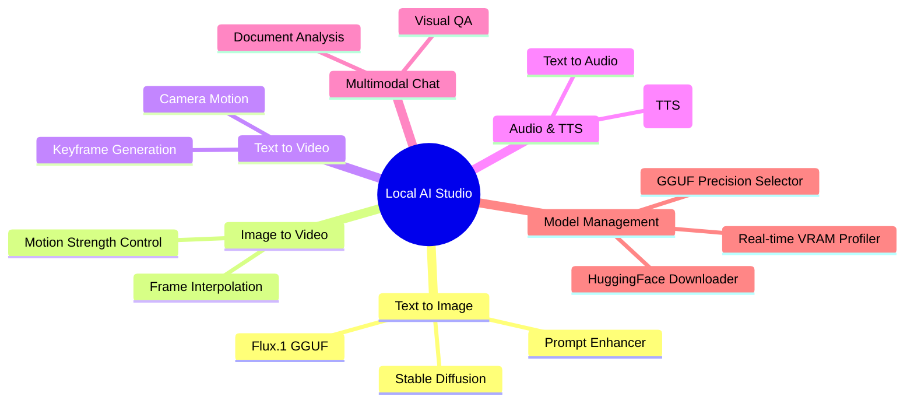

# 🚀 Local AI Studio

> **100% On-Device Multimodal AI Desktop Application**  
> 外部クラウドへの接続なしに、個人PCのGPU/VRAMリソースを活用してテキスト、画像、動画、音声の生成および管理を行う超軽量オンデバイスAIスタジオです。

---

## 📐 システムアーキテクチャ (System Architecture)

Local AI Studioは、**Tauri 2.0 (Rust)**をデスクトップコンテナとして使用し、**React 19**ベースのフロントエンドと**PythonオンデバイスAIエンジン**がリアルタイムでローカル通信を行います。



---

## 🔄 ワークフロー＆データフロー (Data Flow)

ユーザーがプロンプトを入力し、メディアを生成する際の処理フローです。



---

## ✨ 主な機能 (Key Features)



- **🎨 Text-to-Image / Image-to-Video**: Flux.1 GGUFなどの高性能モデルに基づくオンデバイス画像・動画生成。
- **🎙️ Text-to-Audio / TTS**: 高品質な音声合成および効果音生成。
- **💬 Multimodal Chat**: 画像やドキュメントを理解して会話するオンデバイス・ビジュアルAI。
- **✨ Prompt Enhancer**: 短いキーワードを詳細で豊かなプロンプトへ自動拡張。
- **📥 Model Explorer & Auto-Downloader**: HuggingFaceモデルの自動探索および量子化（Q4/Q8）ダウンロード。
- **📊 Real-time VRAM Profiler**: GPUメモリ使用量をリアルタイムチャートでトラッキングし、キャンセルや最適化をサポート。

---

## 🛠️ 技術スタック (Tech Stack)

| レイヤー | 技術スタック | 説明 |
| :--- | :--- | :--- |
| **Desktop Shell** |  | Rustベースの超軽量クロスプラットフォーム・デスクトップフレームワーク |
| **Frontend** |    | Viteの高速ホットリロードおよびReact 19最新機能の適用 |
| **Styling & State** |   | GlassmorphismダークUIデザインおよびグローバル状態管理 |
| **Backend & Engine** |   | ローカルHTTP APIサーバーおよびGGUF / PyTorchモデルオーケストレーター |

---

## 📂 プロジェクト構造 (Directory Structure)

```
local-studio/
├── 📁 src/                   # React 19 フロントエンドソースコード
│   ├── 📁 components/        # 機能別UIタブ (Text2Img, Img2Video, Multimodalなど)
│   ├── 📁 store/             # Zustandベースのグローバル状態管理
│   ├── 📄 App.tsx            # メインダッシュボードレイアウト
│   └── 📄 index.css          # GlassmorphismカスタムCSS & Tailwind
├── 📁 src-tauri/             # Tauri 2.0 Rust デスクトップ設定
│   ├── 📄 tauri.conf.json    # アプリメタデータおよびビルド設定
│   └── 📄 Cargo.toml         # Rust依存パッケージ
├── 📁 backend/               # Python AIオーケストレーションエンジン
│   ├── 📄 main.py            # FastAPIサーバーエンドポイント
│   ├── 📄 orchestrator.py    # AIモデル推論パイプライン
│   ├── 📄 enhancer.py        # プロンプト強化モジュール
│   ├── 📄 downloader.py      # HuggingFaceモデルダウンローダー
│   └── 📄 profiler.py        # VRAMおよびシステムリソースモニター
├── 📁 models/                # ローカルGGUFモデル保存ディレクトリ
└── 📄 package.json           # Node.jsプロジェクト設定
```

---

## 🚀 はじめに (Getting Started)

### 1. 前提条件 (Prerequisites)
- **Node.js**: v18.0.0 以上
- **Python**: v3.10 以上 (PyTorchおよびCUDA環境推奨)
- **Rust**: Tauri v2 ビルド用のRustコンパイラ

### 2. 依存パッケージのインストール (Installation)
```bash
# フロントエンドパッケージのインストール
npm install

# Pythonバックエンド依存関係のインストール
pip install -r backend/requirements.txt
```

### 3. 開発サーバーの起動 (Development)
```bash
# フロントエンドとバックエンドの同時起動
npm run dev

# Tauriデスクトップアプリの起動
npm run tauri dev
```

### 4. プロダクションビルド (Production Build)
```bash
npm run tauri build
```

---

## 📄 ライセンス (License)
本プロジェクトは **MIT License** のもとで公開されています。